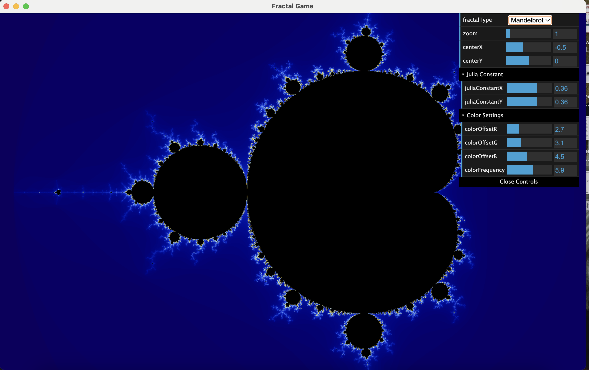
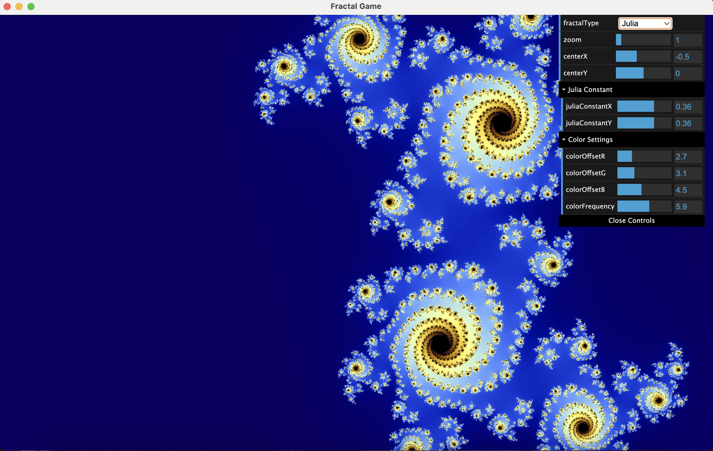

[Home](/) | [Thoughts](/thoughts/) | [Projects](/projects/) | [Publications](/publications/)

## Conway's Game of Life

[Conway's Game of Life](https://en.wikipedia.org/wiki/Conway%27s_Game_of_Life) is a simulation system with extremely simple rules that can evolve into very complex patterns. I find it helpful in understanding biological evolution and GenAI.

I wrote a simple playground in Python ([GitHub Repository](https://github.com/KeriYuu/Conway-s-Game-of-Life)). You can generate random initial states and let them evolve. Eventually, some magical patterns will "survive", such as:

- Rakes: Moving patterns that leave debris behind, which can be used to "lay tracks".

- Breeders: Patterns that produce streams of gliders, causing the number of live cells to grow quadratically or faster.

During my undergraduate studies in physics, I learned about the concept of "emergence" - how complex structures or behaviors can arise from simple microscopic rules. 

Engineers can create controllable systems from these seemingly chaotic structures, similar to how we work with AI black boxes today.

## Fractal

Nassim Nicholas Taleb points out in [The Black Swan](https://en.wikipedia.org/wiki/The_Black_Swan:_The_Impact_of_the_Highly_Improbable) that seemingly similar market fluctuations may conceal entirely different underlying drivers. 

I wrote a simple program ([GitHub Repository](https://github.com/KeriYuu/fractal-game)) to simulate such elegant self-similar structures:  

In the complex iteration formula:

$$
z_{n+1} = z_n^2 + c
$$

If the sequence doesn't diverge, the constant \(c\) belongs to the Mandelbrot set.  
When fixing \(c\) and iterating \(z_{n+1} = z_n^2 + c\), all initial \(z_0\) points whose sequences remain bounded form the Julia set.  

| {: .equal-width } | {: .equal-width } |
|:-------------------------------------------------------:|:------------------------------------------------:|
| Mandelbrot Set                                         | Julia Set                                         |

Darker colors in the figure indicate more iterations required.  

The fractal boundary marks the division between "stable orbits" and "escape trajectories" – we observe how slight perturbations in initial values can lead to radically different outcomes (convergence or divergence).